<picture>
  <source media="(prefers-color-scheme: dark)" srcset="./assets/hero-dark.svg">
  <source media="(prefers-color-scheme: light)" srcset="./assets/hero-light.svg">
  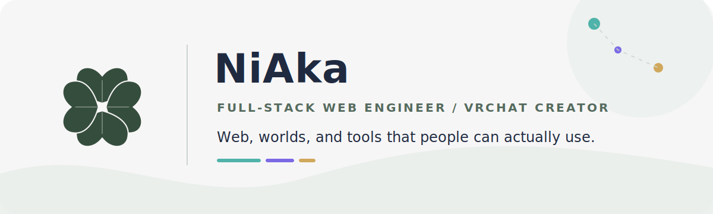
</picture>

## Web開発が本業です。

VRChatではワールドやギミックを作っています。最近は、AIエージェントにUdonSharpをちゃんと書かせるためのOSSも育てています。

*Full-stack web engineer. I also build VRChat worlds and tools, and maintain open-source skills that help coding agents write better UdonSharp.*

<table>
  <tr>
    <td align="center" width="33%"><strong>200+</strong><br><sub>OSS GitHub Stars</sub></td>
    <td align="center" width="33%"><strong>6+ years</strong><br><sub>Web Development</sub></td>
    <td align="center" width="33%"><strong>20K visits</strong><br><sub>in 2 days — あまやどかり</sub></td>
  </tr>
</table>

## Open Source

### [agent-skills-vrc-udon](https://github.com/niaka3dayo/agent-skills-vrc-udon)

> **AIが書くUdonSharpを、もう少しまともにする。**

普通のC#では通るのに、UdonSharpでは使えない書き方が結構あります。このリポジトリには、その違いをAIエージェントへ教えるルール、実装例、チェック用のフックをまとめています。

Claude Code、Codex、Cursorなどで使えるAgent Skillsです。日本語を含む5言語に対応しています。

```sh
npx skills add niaka3dayo/agent-skills-vrc-udon
```

*Rules, examples, and validation hooks for agents that write UdonSharp.*<br>
*I make agents dance.*

## NiAkaDo / NiAka堂

ワールド制作で面倒だったところを、小さな道具にしています。シェーダー、Prefab、Unityエディタ拡張などを[BOOTH](https://niaka.booth.pm/)で配布しています。無料で使えるものもあります。

*Small tools made while building VRChat worlds.*

<table>
  <tr>
    <td width="33%" valign="top">
      <a href="https://booth.pm/ja/items/8568688">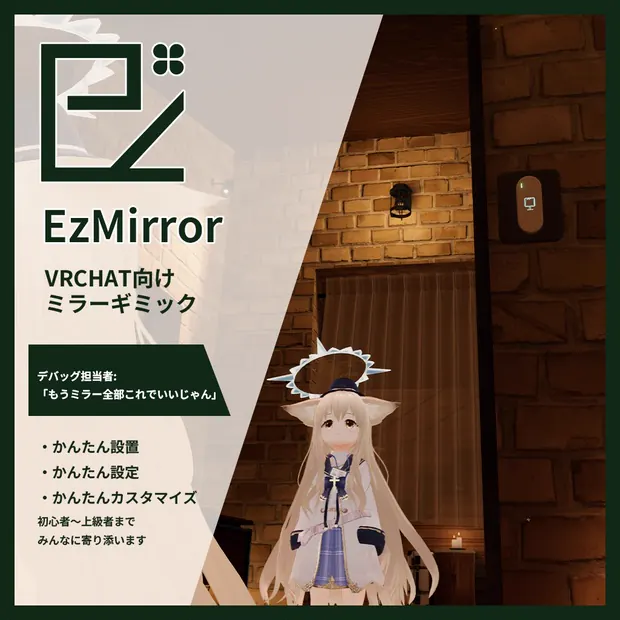</a><br>
      <strong><a href="https://booth.pm/ja/items/8568688">EzMirror</a></strong>
    </td>
    <td width="33%" valign="top">
      <a href="https://booth.pm/ja/items/8320267">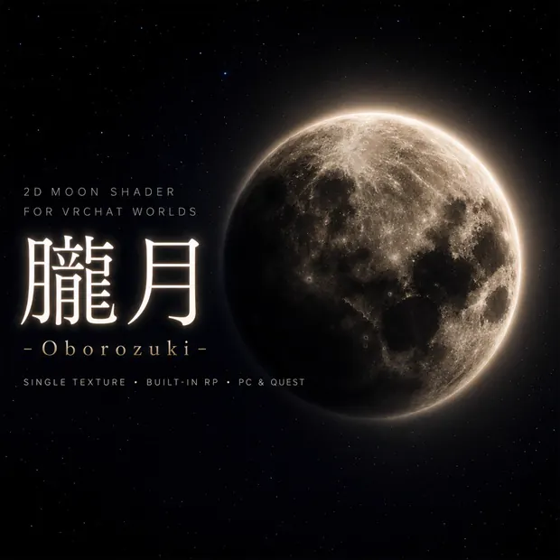</a><br>
      <strong><a href="https://booth.pm/ja/items/8320267">朧月 - Oborozuki Shader</a></strong>
    </td>
    <td width="33%" valign="top">
      <a href="https://booth.pm/ja/items/7719130">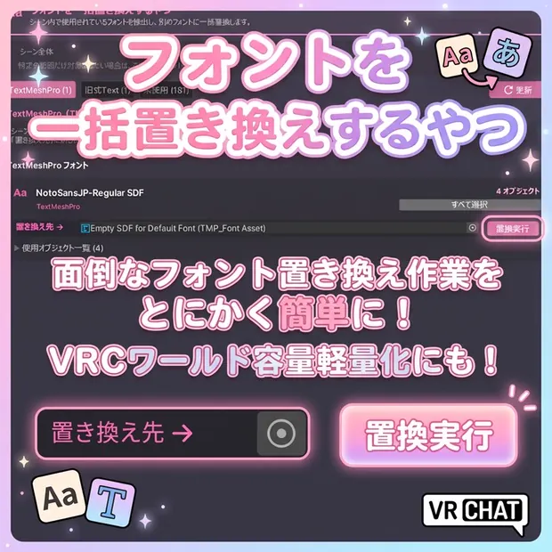</a><br>
      <strong><a href="https://booth.pm/ja/items/7719130">フォントを一括置き換えするやつ</a></strong>
    </td>
  </tr>
</table>

- **EzMirror** — 置くだけで使える、軽量なVRChat向けミラーPrefab。無料。
- **朧月** — 月の満ち欠けと雲の表情を作るシェーダー。無料。
- **フォントを一括置き換えするやつ** — Unityプロジェクト内のフォントをまとめて差し替えるエディタ拡張。

### [NiAkaDev VPM Repository](https://vpm.2aka.io/)

<a href="https://vpm.2aka.io/">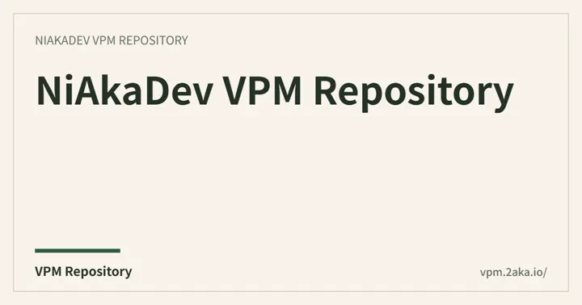</a>

VCC / ALCOMからNiAka堂のパッケージを導入・更新するための公式VPMリポジトリです。現在はEzMirrorを配布しています。

`Repository ID: io.2aka.vpm` · [`index.json`](https://vpm.2aka.io/index.json)

## Web Development

フロント、API、データベース、インフラまで担当します。TypeScriptとReactを中心に、要件整理から実装、運用までやっています。必要ならPHP、Python、AWS、Cloudflareも触ります。作って終わりではなく、公開してから直していく仕事が好きです。

CTOや開発リードとして、技術選定、設計、レビュー、リリース後の改善まで見てきました。

| | よく使うもの |
| --- | --- |
| Frontend | `TypeScript` `React` `Next.js` `Astro` |
| Backend | `Laravel` `Python` `REST API` |
| Platform | `Cloudflare` `AWS` `Docker` |
| Quality | `CI/CD` `E2E` `Visual Regression Testing` |

*I work across the stack, from product requirements and UI to APIs, infrastructure, and operations.*

## Web × VRChat

Webだけ、Unityだけで閉じない案件もやっています。Web側の状態をワールドへ渡したり、イベント運営の手間を減らしたり、その場で実際に使えるところまで作ります。

<table>
  <tr>
    <td width="50%" valign="top">
      <a href="https://vrc-aquelia.com/">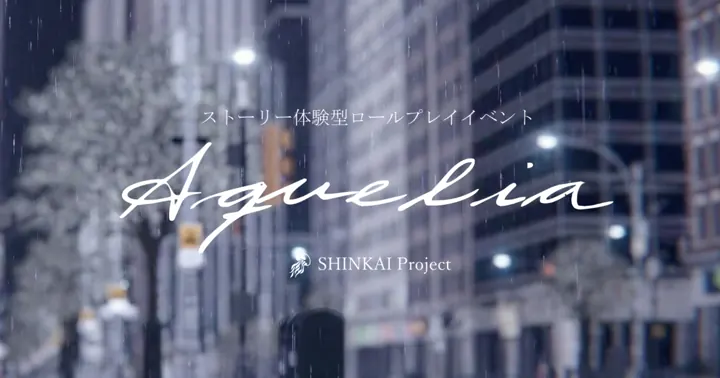</a><br>
      <strong><a href="https://vrc-aquelia.com/">深海プロジェクト Aquelia</a></strong>
    </td>
    <td width="50%" valign="top">
      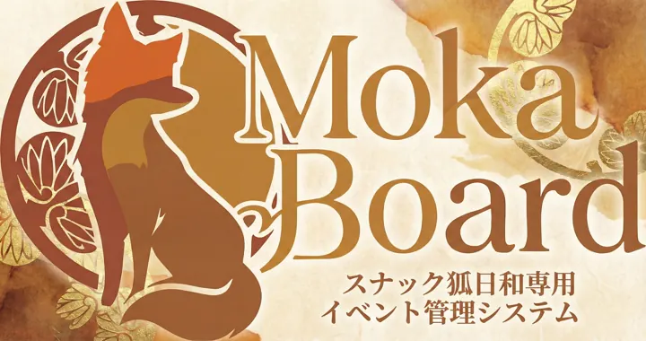<br>
      <strong>MokaBoard</strong>
    </td>
  </tr>
</table>

- **深海プロジェクト Aquelia** — 公式サイトとキャラクター管理システム「観測室」を担当。Next.js / React / Cloudflare D1・R2。
- **MokaBoard** — 「スナック狐日和」専用。Webシステムとワールド内表示をつなぐ連動型ギミック。

*Web systems that extend what can happen inside a VRChat world.*

## VRChat Worlds

### 公開ワールド / Public Worlds

<table>
  <tr>
    <td width="50%" valign="top">
      <a href="https://vrchat.com/home/launch?worldId=wrld_4a41c522-fc84-4cc0-aee4-ab2fddee73f1">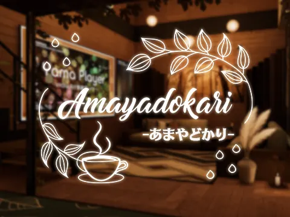</a><br>
      <strong><a href="https://vrchat.com/home/launch?worldId=wrld_4a41c522-fc84-4cc0-aee4-ab2fddee73f1">あまやどかり</a></strong>
    </td>
    <td width="50%" valign="top">
      <a href="https://vrchat.com/home/launch?worldId=wrld_12c89f0b-81c4-4d8f-9184-eb07143e961a">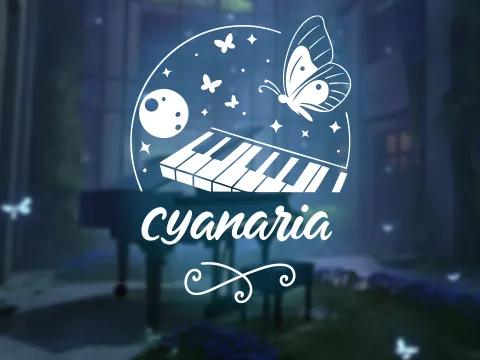</a><br>
      <strong><a href="https://vrchat.com/home/launch?worldId=wrld_12c89f0b-81c4-4d8f-9184-eb07143e961a">Cyanaria</a></strong>
    </td>
  </tr>
</table>

- **あまやどかり** — 雨宿りのための公開ワールド。公開2日で20,000 visits / 3,300 favorites。
- **Cyanaria** — 青い光と水の気配を楽しむ公開ワールド。

### イベント用非公開ワールド / Private Event Worlds

<table>
  <tr>
    <td width="50%" valign="top">
      <a href="https://vrchat.com/home/group/grp_497626aa-0f05-4959-ba2f-4c04626641e3">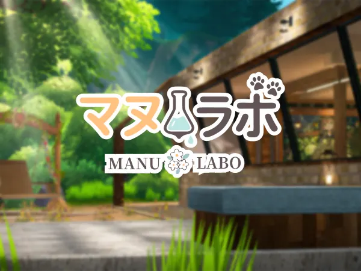</a><br>
      <strong><a href="https://vrchat.com/home/group/grp_497626aa-0f05-4959-ba2f-4c04626641e3">マヌラボ</a></strong>
    </td>
    <td width="50%" valign="top">
      <a href="https://vrchat.com/home/group/grp_cf22616c-5903-4467-87e9-f1ebd5d592dd">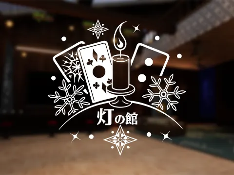</a><br>
      <strong><a href="https://vrchat.com/home/group/grp_cf22616c-5903-4467-87e9-f1ebd5d592dd">灯の館</a></strong>
    </td>
  </tr>
</table>

- **マヌラボ** — イベント用非公開ワールドを制作。Webから動かせる連動ギミックも担当。
- **灯の館** — イベント用非公開ワールドを制作。イベントの雰囲気に合わせて空間を設計。

## About

仕事ではフルスタックのWeb開発、個人ではVRChatのワールドやUnity向けツールを作っています。コードを書くこと自体より、実際に使えるところまで持っていくほうが好きです。

最近はAIエージェントを使った開発のやり方を試しつつ、良かったものをOSSに戻しています。

*I like shipping things, watching how people use them, and improving them after release.*

### Links

[GitHub](https://github.com/niaka3dayo) · [Zenn](https://zenn.dev/nayushi) · [note](https://note.com/2aka) · [X](https://x.com/niaka3vrc) · [BOOTH](https://niaka.booth.pm/) · [VPM](https://vpm.2aka.io/)
